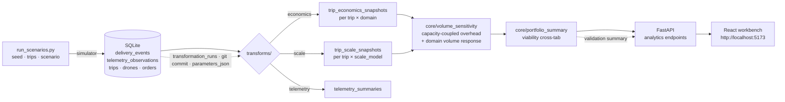

# Drone Deliveries — Last-Mile Economics Pipeline

> **Event-driven analytics pipeline using synthetic drone delivery data to
> evaluate last-mile delivery economics.** Operational events flow into
> SQLite, rerunnable transforms layer economic overlays on top, and an
> analytical workbench surfaces the question the pipeline was built to
> answer: *under what combination of capacity, scale, and delivery mix
> does drone delivery actually clear break-even?*

## Key findings (live, from the current local DB)

The viability grid below cross-tabulates three capacity-cost structures
against four delivery-domain assumptions. Each cell asks the same
question: *does the synthetic model find a delivery volume at which
this domain breaks even, and does that volume sit inside the domain's
addressable demand?*


Findings extracted from the live grid:

- **`pilot_capacity` is fundamentally non-viable** — every domain ends
  the sweep red. Below ~20 deliveries per drone per day, fixed overhead
  dominates and no volume within addressable demand clears it.
- **`regional_capacity` and `dense_urban_capacity` both produce break-even
  for every domain within addressable demand** — 8 viable cells / 0
  beyond-ceiling / 4 never.
- **Regional reaches break-even at *lower* volume than dense-urban**
  (≈150–250 / day vs ≈250–400 / day). Smaller absolute daily overhead
  amortises faster, even though dense-urban's per-drone productivity is
  higher.
- **The tightest addressable ceiling is `urgent_documents` at 600 / day.**
  Its break-even sits at 150 / day under regional cost — comfortably
  inside the ceiling.
- **No yellow cells under the current registry**: whenever the model
  finds break-even, that break-even sits inside addressable demand.
  This is the kind of regression a reviewer should watch for if either
  capacity costs or domain ceilings move.

The aggregated dictionary that backs these bullets is embedded as a
[live snapshot below](#numbers-shown-above-live-snapshot).

### How to read the grid

- **Green** — model finds break-even at or below the listed delivery
  volume, and that volume sits inside the domain's addressable demand.
  The cell label shows the lowest sweep point that crossed zero and
  the domain's addressable ceiling.
- **Yellow** — model finds break-even, but only past the addressable
  ceiling. Useful as a "what would it take?" extrapolation; not a
  conclusion.
- **Red** — no sweep point clears zero. Capacity overhead dominates
  for the entire addressable range.

## What this demonstrates

Skills the project exercises, in roughly the order a reviewer would
encounter them:

- **Event-driven data modelling.** Append-only `delivery_events` log
  with projections rebuilt deterministically from the event stream.
- **Snapshot-based analytical lineage.** Per-trip, per-overlay snapshot
  tables (`trip_economics_snapshots`, `trip_scale_snapshots`,
  `telemetry_observations`) joined back through `transformation_runs`
  for full provenance.
- **Rerunnable transforms.** Economics, scale, hybrid, and telemetry
  overlays composed in pipeline order; every recompute writes a new
  `transformation_runs` row carrying git commit + parameter JSON.
- **Rule-based validation.** Structural invariants across the snapshot
  tables, severity-tagged (INFO / WARN / ERROR), audited per-run.
- **Capacity-coupled cost modelling.** Required fleet, operators, and
  chargers derived from delivery volume rather than asserted.
- **Synthetic comparative analytics.** Bounded domain-volume-response
  helpers, sweep-driven break-even discovery, viability cross-tab.
- **FastAPI + React analytical workbench.** Read-only routes over the
  same snapshot tables; routed UI with shareable URLs for every
  analytical view.
- **Single-command launcher.** `python workbench.py` boots backend and
  frontend in one terminal with pre-flight schema migration.

## What this does not claim

- **Not a routing or operations system.** No GIS, no path planning,
  no charging-queue simulation, no traffic.
- **Not real demand or cost data.** Every dollar value is synthetic and
  documented as such at its registry of origin.
- **Not predictive.** Curves and cells answer *"if these assumptions
  held, what would the model say?"* — they do not forecast real demand
  elasticity.
- **Not measured fleet productivity.** `deliveries_per_drone_per_day`
  is an analytical knob; it is not validated against any drone vendor's
  duty-cycle data.

## Run it

```bash
# One-time seed (≈30 s on a typical laptop):
python run_scenarios.py --scenarios urban_dense suburban_standard rural_extended --trips 100 --seed 42
python run_transforms.py --all-runs --all-delivery-domains
python run_transforms.py --all-runs --all-scale-models
python run_visualizations.py --db data/delivery_system.sqlite --out outputs/charts

# Launch (single command, opens http://localhost:5173):
python workbench.py
```

`workbench.py` handles the FastAPI backend and Vite dev server in one
terminal, runs `npm install` on first boot, and forwards Ctrl-C for a
clean shutdown.

## Architecture



**Suggested GitHub About**: *Event-driven analytics pipeline using
synthetic drone delivery data to evaluate last-mile delivery economics.*

<details>
<summary>Numbers shown above (live snapshot)</summary>

The bullet list above is generated from `core.portfolio_summary.generate_portfolio_summary`.
The raw aggregator output against the current `data/delivery_system.sqlite`:

```json
{
  "viability_states":            {"viable": 8, "beyond": 0, "never": 4},
  "viability_by_capacity": {
    "dense_urban_capacity":      {"viable": 4, "beyond": 0, "never": 0},
    "pilot_capacity":            {"viable": 0, "beyond": 0, "never": 4},
    "regional_capacity":         {"viable": 4, "beyond": 0, "never": 0}
  },
  "capacity_models_fully_viable": ["dense_urban_capacity", "regional_capacity"],
  "capacity_models_fully_red":    ["pilot_capacity"],
  "capacity_models_mixed":        [],
  "headline": {
    "lowest_breakeven_cells": [
      {"capacity_model": "regional_capacity", "delivery_domain": "medical_delivery",
       "breakeven_deliveries_per_day": 150, "addressable_ceiling": 800},
      {"capacity_model": "regional_capacity", "delivery_domain": "urgent_documents",
       "breakeven_deliveries_per_day": 150, "addressable_ceiling": 600}
    ],
    "tightest_addressable_ceiling": {"domain": "urgent_documents", "ceiling": 600}
  },
  "run_counts":                  {"simulation_runs": 3, "experiments": 3}
}
```

Regenerate with:

```bash
python -c "from core.portfolio_summary import generate_portfolio_summary; \
import json; \
print(json.dumps(generate_portfolio_summary('data/delivery_system.sqlite'), indent=2))"
```

</details>

<details>
<summary>Deep dive: architecture, scenarios, overlays, lineage, validation</summary>

The sections below describe the operational pipeline in detail. They
existed before the portfolio rewrite and are preserved for technical
review.

</details>

---

## Event model

### Event types

| Event | Meaning |
|---|---|
| `order_created` | A delivery request entered the system. |
| `drone_assigned` | A drone was matched to a pending order. |
| `drone_launched` | A drone left the depot at the start of a leg. |
| `telemetry_ping` | Position + battery sample mid-flight. |
| `pickup_completed` | Drone reached the pickup location (end of leg 1). |
| `delivery_completed` | Drone delivered the package to the customer (end of leg 2). |
| `returned_to_depot` | Drone landed back at the depot (end of leg 3); operational trip done. |
| `battery_warning` | Battery dropped below a threshold mid-flight. |
| `route_deviation` | Drone deviated from the expected route. |
| `emergency_return` | Trip aborted; drone returned to depot. |
| `maintenance_required` | Drone flagged for service between trips. |
| `maintenance_completed` | Drone finished service and returned to the idle pool. |
| `error` | Catch-all for software/operational failures. |

### Event schema (`delivery_events` table and JSONL columns)

| Column | Type | Notes |
|---|---|---|
| `event_id` | TEXT (UUID) | Primary key. |
| `event_time` | TIMESTAMP | When the event happened (simulation clock). |
| `ingested_at` | TIMESTAMP | When the row landed in the store. |
| `drone_id` | TEXT, nullable | Null for `order_created`. |
| `trip_id` | TEXT, nullable | Null for events unrelated to a trip. |
| `leg_id` | TEXT, nullable | Set for mid-flight events. |
| `event_type` | TEXT | One of the values above. |
| `latitude` | REAL, nullable | WGS-84. |
| `longitude` | REAL, nullable | WGS-84. |
| `battery_pct` | REAL, nullable | 0–100. |
| `payload_json` | TEXT, nullable | Event-specific detail. Kept as a string on purpose (see Design notes). |

---

## Repository layout

```
core/
  models.py        # DeliveryEvent + Drone/Order/Trip/TripLeg dataclasses, status enums
  events.py        # event-type constants, emit(), fetch_events()
  projections.py   # cursor-level projection updaters for orders/drones/trips
  setup_db.py      # SQLite schema creation
  simulator.py     # synthetic event-stream generator
  sinks.py         # JsonlSink + export_events_to_jsonl helper
  order_manager.py # create_order / fetch_order helpers
analytics/sql/     # SQLite-compatible analytics queries
run_simulation.py  # CLI: run the simulator (+ optional JSONL export)
run_analytics.py   # CLI: execute all analytics/sql/*.sql against the DB
legacy/terrain_v1/ # earlier A* pathfinder + elevation pipeline (not wired in)
data/              # runtime SQLite + JSONL artifacts (gitignored)
```

Some older sandbox directories (`scripts/`, `dev/`, `research/`, etc.)
remain on disk for now. Cleanup is incremental.

---

## Quickstart

```bash
python -m venv .venv
# Windows PowerShell
.venv\Scripts\Activate.ps1
# macOS / Linux
source .venv/bin/activate

pip install -r requirements.txt

python run_simulation.py --reset --drones 3 --trips 10 --seed 42 \
    --export-jsonl data/events.jsonl

python run_analytics.py
```

> **Note on `requirements.txt`.** The current simulator and analytics
> stack uses only the Python standard library. `requirements.txt` still
> lists `numpy`, `matplotlib`, `rasterio`, `scipy`, and `strm` from the
> legacy pathfinding pipeline. They are only needed if you intend to
> run code under `legacy/terrain_v1/`. The Phase 1–3 code will install
> and run without any of them.

---

## Example output (seed = 42)

```
--- Simulation summary -----------------------------------------
  db_path:          data/delivery_system.sqlite
  drones:           3
  trips_requested:  10
  trips_completed:  10
  events_written:   245
  event_counts_by_type:
    battery_warning            10
    delivery_completed         10
    drone_assigned             10
    drone_launched             10
    maintenance_completed       3
    maintenance_required        4
    order_created              10
    pickup_completed           10
    returned_to_depot          10
    route_deviation             7
    telemetry_ping            161
  jsonl_export:     data/events.jsonl (245 rows)
```

Each trip is the full three-leg cycle: `drone_launched → pickup_completed
→ delivery_completed → returned_to_depot`. Larger runs (e.g. 8 drones × 150
trips) will surface `emergency_return` events; in those, the aborted trip
ends after `emergency_return` with no `delivery_completed` or
`returned_to_depot`.

---

## Analytics examples

The queries in `analytics/sql/` are SQLite-compatible. Each answers one
operational question.

| File | Question it answers |
|---|---|
| `event_counts.sql` | What did the simulator emit, and how much of each event type? |
| `orders_by_status.sql` | How did orders end up — delivered, errored, still pending? |
| `drone_utilization.sql` | Per drone: how many trips, current status, battery, telemetry volume, warnings, deviations, returns, maintenance flags. |
| `trip_outcomes.sql` | Per trip: launched_at, completed_at, status, leg progress, duration in seconds. |
| `battery_warnings_per_drone.sql` | Which drones triggered the most low-battery warnings, lowest battery seen, latest reading. |

Run them all at once with `python run_analytics.py`, or individually:

```bash
sqlite3 data/delivery_system.sqlite < analytics/sql/drone_utilization.sql
```

---

## Scenarios

The simulator can run under different **operational scenarios** so the
same event pipeline can answer comparative questions like *"would drone
delivery make sense in dense urban, suburban, or rural conditions?"*. A
scenario is a small bag of knobs (target trip distance, telemetry
density, battery drain, emergency-return probability, maintenance
duration, etc.) — switching scenarios does **not** change the event
vocabulary or the schema; it just shifts the rates and quantities the
simulator emits.

**Phase 14 made scenario assumptions causally active**, not just
descriptive: pickup and dropoff coordinates are now sampled around the
depot with a radius derived from `avg_trip_distance_km`, telemetry
density scales with leg distance (~1.5 pings/km), and post-trip
maintenance probability is bumped by low end-of-trip battery and by
long trips. Observed average trip distance now tracks the configured
value to within ~1–2 km across all three built-in scenarios.

Built-in scenarios (see `core/scenarios.py`):

| Scenario | Telemetry | Battery drain | Route deviations | Emergency returns | Maintenance |
|---|---|---|---|---|---|
| `urban_dense` | denser (+2 pings/leg) | gentler (×0.8) | more likely (10%) | rare (2%) | short cycles (180 s) |
| `suburban_standard` | baseline | baseline (×1.0) | baseline (5%) | baseline (5%) | baseline (240 s) |
| `rural_extended` | baseline | harder (×1.6) | rare (2%) | more likely (10%) | longer cycles (360 s) |

Run several scenarios into the same database and compare:

```bash
python run_scenarios.py --reset --scenarios urban_dense suburban_standard rural_extended \
    --drones 3 --trips 50 --seed 42

python run_analytics.py            # includes scenario_summary.sql
python run_visualizations.py --db data/delivery_system.sqlite --out outputs/charts
```

Every event and every trip carries a `scenario_name` column so
`analytics/sql/scenario_summary.sql` can group cleanly. A
`scenario_comparison.png` chart is added to the standard PNG set when
scenario-tagged events are present.

The project is increasingly framed as **comparative operational analysis**
on top of a synthetic event stream, not a routing optimiser.

---

## Cost & feasibility modeling

Each scenario also carries a small bag of **synthetic economics** knobs —
energy cost per kWh, kWh per km, maintenance cost per event, labor cost
per delivery, drone depreciation, emergency-return penalty, delivery fee
— and the simulator computes a per-trip economics row at trip end using
transparent formulas (see `_compute_economics` in `core/simulator.py`).

> **Disclaimer.** Costs and revenue here are **illustrative synthetic
> units**, not a real cost model. The goal is comparative feasibility
> ("which scenarios bleed more?"), not financial forecasting.

Persisted to the `trips` table per trip:

```
trip_distance_km, estimated_energy_cost, estimated_maintenance_cost,
estimated_operational_cost, estimated_revenue, estimated_profit,
emergency_return_penalty_applied
```

Formulas (all per trip):

```
energy_cost     = distance_km × avg_kwh_per_km × energy_cost_per_kwh
maintenance     = maintenance_events × maintenance_cost_per_event
operational     = energy + maintenance + labor + depreciation + emergency_penalty
revenue         = delivery_fee  (0 if aborted)
profit          = revenue − operational
```

Aborted trips still incur operational cost (and the emergency-return
penalty) but earn no revenue, so they show up as negative-profit rows in
`analytics/sql/scenario_economics.sql`.

Example findings at `--trips 100 --seed 42` (synthetic units):

| scenario | completed | aborted | total_profit | avg/trip | emergency_returns |
|---|---:|---:|---:|---:|---:|
| `urban_dense` | 100 | 0 | -780 | -7.80 | 0 |
| `suburban_standard` | 95 | 5 | -1,197 | -11.97 | 5 |
| `rural_extended` | 84 | 16 | -3,906 | -39.06 | 16 |

Same direction as the operational analytics: urban completes more, costs
less, and absorbs fewer emergency-return penalties. Rural carries roughly
**5× the per-trip loss** of urban under these knobs.

Commands:

```bash
python run_scenarios.py --reset \
    --scenarios urban_dense suburban_standard rural_extended \
    --trips 100 --seed 42
python run_analytics.py             # includes scenario_economics.sql
python run_visualizations.py --db data/delivery_system.sqlite --out outputs/charts
```

---

## Business intelligence layer

On top of the operational and economic data the project ships a small
**rule-based** BI layer that turns scenario metrics into rankings and
plain-English recommendations.

> **Disclaimer.** No ML, no forecasting, no LLM. Every output is an
> arithmetic combination of SQL aggregates followed by a hand-written
> rule. The synthetic cost model from the previous section still
> applies — all numbers are illustrative.

Inputs (per scenario, computed from `trips` and `delivery_events`):

- `completion_rate` (0..1)
- `profit_margin_pct` (signed)
- `emergency_rate` (events / trip)
- `maintenance_per_trip` (events / trip)

Feasibility score:

```
score = 50 * completion_rate
      + 30 * clip(profit_margin_pct / 100, -1..+1)
      - 40 * emergency_rate
      - 10 * maintenance_per_trip
```

Labels:

| Range | Label |
|---|---|
| `score >= 25` | `strong_candidate` |
| `10 <= score < 25` | `borderline` |
| `score < 10` | `poor_candidate` |

The weights and thresholds live at the top of
`core/business_intelligence.py` and are tuned to the current built-in
scenarios; revisit them if you change the cost model.

Recommendation rules (no scenario names hard-coded — they're derived):

- The best- and worst-ranked scenarios are always called out by name.
- If every scenario runs at a loss, the report suggests raising
  `delivery_fee` or reducing maintenance/emergency costs.
- Any scenario with `emergency_rate >= 0.08` is flagged as
  emergency-driven.
- Any scenario with `maintenance_per_trip >= 0.30` is flagged for
  maintenance burden.
- For every scenario the report computes a per-completed-trip
  breakeven `delivery_fee` and suggests the gap.

Example output (seed=42, 100 trips, three built-in scenarios):

```
scenario             score  label              complete  avg_profit/trip  emerg_rate  maint/trip
-------------------  -----  -----------------  --------  ---------------  ----------  ----------
urban_dense          32.1   strong_candidate   1.00      -7.80            0.00        0.49
suburban_standard    22.6   borderline         0.95      -11.97           0.05        0.40
rural_extended        1.6   poor_candidate     0.84      -39.06           0.16        0.40

- urban_dense has the strongest feasibility profile in this comparison
  (score 32.1, label 'strong_candidate').
- rural_extended has the weakest feasibility profile
  (score 1.6, label 'poor_candidate').
- Every evaluated scenario runs at a loss under the current cost
  assumptions; consider raising delivery_fee or reducing
  maintenance_cost_per_event.
- Emergency returns are a major loss driver in: rural_extended.
- Raising delivery_fee by ~46.50 units in rural_extended would
  approach breakeven on completed trips.
```

Commands:

```bash
python run_scenarios.py --reset \
    --scenarios urban_dense suburban_standard rural_extended \
    --trips 100 --seed 42

python run_business_intelligence.py --db data/delivery_system.sqlite
# Optional markdown report:
python run_business_intelligence.py --db data/delivery_system.sqlite \
                                    --markdown outputs/reports/bi_report.md
```

`analytics/sql/feasibility_summary.sql` exposes the same per-scenario
metric rows (without the Python scoring layer) for ad-hoc queries.

---

## Assumptions & calibration

The simulator runs on a small set of explicit knobs. Two categories:

- **publicly informed** — picked to land in plausible public ranges
  (urban single-digit-km vs rural longer trips, ~20–35% low-battery
  alerts, ~0.05–0.15 kWh/km drone energy, residential retail
  electricity, last-mile fees, field-service costs). No specific source
  is cited; values are chosen to land in defensible ballparks, not to
  match any one study.
- **explicitly synthetic** — invented for comparative simulation
  behaviour (emergency-return / route-deviation / maintenance
  probabilities, drain multiplier, BI scoring weights and label
  thresholds).

The narrative — including which knob is which, why direction matters
more than absolute values, and what is *intentionally not modelled* —
lives in [`docs/assumptions.md`](docs/assumptions.md). A
machine-readable view is in [`core/assumptions.py`](core/assumptions.py).

The simulator's outputs remain **comparative, not predictive.** It is
meant for exploratory operational analysis ("which scenario bleeds
least, and what would help?"), not forecasting.

```bash
python run_assumptions_report.py
python run_assumptions_report.py --markdown outputs/reports/assumptions_report.md

# Observed-vs-assumed analytics:
sqlite3 data/delivery_system.sqlite < analytics/sql/assumption_summary.sql
```

---

## Architecture: source system / transforms / analytics

Phase 20 decomposed the project along the data-engineering lifecycle.
The simulator is now treated like a **source system** that emits raw
operational events. A **transform layer** derives analytical state
(economics, hybrid decisions). **Analytics** (DuckDB, SQL files,
charts, the API and frontend) read from the derived state.

```
┌─────────────────┐   raw events    ┌──────────────────┐   derived state   ┌─────────────────┐
│ core/simulator  │ ──────────────► │  transforms/     │ ────────────────► │ analytics + UI  │
│ (source system) │                 │ (re-computable)  │                   │ (read-only)     │
└─────────────────┘                 └──────────────────┘                   └─────────────────┘
   simulation_runs                   transformation_runs
   (source lineage)                  (derivation lineage)
```

What lives where:

| Layer | Owns | Examples |
|---|---|---|
| `core/simulator.py` | Raw event emission, trip/order/leg row creation, dispatch state, telemetry, maintenance, emergency returns | Writes `delivery_events`, `orders` (intrinsic fields only), `trips`, `trip_legs` |
| `transforms/economics.py` | Distance derivation, energy/maintenance/labour costs, revenue, profit | Updates `trips.estimated_*` columns |
| `transforms/hybrid.py` | Fulfillment-mode decision, activation reason, truck baseline, drone latency estimate | Updates `orders.fulfillment_mode` etc. |
| `analytics/` + `api/` + `frontend/` | Aggregation, BI scoring, calibration drift, charts, workbench UI | Read-only over derived state |

Two key consequences:

1. **Analytical assumptions are recomputable without re-running the
   simulator.** Override `EconomicModel` or `HybridThresholds` and call
   the transform again; events stay untouched.
2. **Lineage is split.** `simulation_runs` tracks *what produced these
   events*. `transformation_runs` tracks *what derivation logic was
   applied to them*. When a calibration number changes between commits,
   you can tell whether the simulator changed or the derivation
   changed.

### Running the pipeline

```bash
# 1. Simulate (transforms auto-run by default).
python run_scenarios.py --reset \
    --scenarios urban_dense suburban_standard rural_extended \
    --trips 100 --seed 42

# 2. (Optional) re-derive with different assumptions, no re-sim needed.
python run_transforms.py --all-runs

# 3. Scope to one transform, one run.
python run_transforms.py --run-id <id> --transform economics
```

### Storage layers — honest framing

| Layer | Role | Required? |
|---|---|---|
| **SQLite** | Operational source of truth + derived state | Yes |
| **Parquet** | Analytical export format for portability | No — optional |
| **DuckDB** | OLAP engine; can read Parquet *or* SQLite directly | Optional |

Phase 20 reframes Parquet as an **export format** rather than a
required persistence layer. DuckDB ships with a `sqlite_scanner`
extension, so the analytics layer can query SQLite without going
through Parquet at all (see `core/duckdb_analytics.open_duckdb_for_sqlite`).
Parquet exports remain useful when you want to ship runs elsewhere or
load them into a real lakehouse — they're just no longer load-bearing.

### Versioned baselines

The "seed=42 must always equal X events forever" invariant has been
replaced with an explicit registry in `tests/baselines.py`. When the
simulator semantics change in a way that shifts event counts on
purpose, bump `SIMULATOR_VERSION` and add a new entry. Tests prefer
*behavioral invariants* (no double-assignment, no NaN economics, drones
faster than trucks on average) over exact counts where appropriate.

---

## Operational telemetry (Phase 21)

The simulator emits the kind of values a real drone flight controller
would surface on its telemetry channel — not a derived "stress score",
not a forecast, just observables. Each `telemetry_ping` event has a
matching row in the new `telemetry_observations` side-table with:

| Field | Units | Plausibility band |
|---|---|---|
| `altitude_m` | metres AGL | 0–120 (Part 107 ceiling) |
| `airspeed_mps` | metres/sec | 0–30 (cruise ~14, sport top ~25) |
| `heading_deg` | degrees | 0–360 |
| `vertical_speed_mps` | metres/sec | ±5 (climb / descent) |
| `battery_temp_c` | °C | 15–60 normal, >45 warm, >55 concerning |
| `motor_temp_c` | °C | 20–80 normal, ~95 thermal limit |
| `estimated_remaining_range_km` | km | controller's own SoC × capacity-fade estimate |
| `signal_strength_pct` | % | 0–100 (RC link) |
| `gps_signal_quality` | 0–100 | synthetic quality score |

Plus a new event type `obstacle_warning` (discrete events stay
discrete) and two slowly-changing drone-level columns
(`battery_cycle_count`, `battery_health_pct`).

**On-board emergency trigger.** Whenever the on-board controller's own
remaining-range estimate falls below the straight-line distance back to
depot × 1.15, the simulator now emits an `emergency_return` with
`payload.reason = "onboard_remaining_range"` and routes back to depot
mid-leg. The previous RNG-driven trigger still exists for "obstacle /
weather / unknown" emergencies.

**Source vs derived.** The observations table is *raw*. Anomaly counts
(battery > 50 °C, motor > 85 °C, signal < 60%, GPS degraded), trends,
and per-scenario summaries are derived by `transforms/telemetry.py`,
which the auto-discovering pipeline runs last (`RUN_ORDER = 30`):

```bash
python run_scenarios.py --reset \
    --scenarios urban_dense suburban_standard rural_extended \
    --trips 100 --seed 42
# transforms (economics → hybrid → telemetry) auto-run.

# Recompute just telemetry with new thresholds, no resim:
python run_transforms.py --all-runs --transform telemetry

# Inspect via API:
curl http://localhost:8000/analytics/telemetry-summary
curl http://localhost:8000/analytics/telemetry-health
```

The frontend's new **Operational telemetry** tab surfaces the signal-
quality metric grid, per-scenario anomaly counts, drone-health table,
and the two new charts.

---

## Delivery-domain reinterpretation (Phase 22)

The economics transform now accepts a **demand-side overlay** — a
`DeliveryDomain` profile that influences revenue without touching any
physics-side field.  The same operational events produce different
economics under different domains.

Layering rule (pinned in `core/delivery_domains.py`):

| Layer | What it owns |
|---|---|
| `Scenario` | operational knobs (battery drain, telemetry density, distance) |
| `EconomicModel` | per-trip unit prices ($/kWh, $/event, base delivery_fee) |
| `delivery_domain` | demand-side characteristics (who orders, what they carry, what they'll pay, how urgent) |
| `scale_model` | (Phase 23) fleet-wide structural costs |

Built-in profiles in `core/delivery_domains.py`:

| Profile | Payload | Urgency | Premium share | AOV (USD) |
|---|---:|---:|---:|---:|
| `food_delivery` | ~0.8 kg | 55% high | 30% | 25 |
| `medical_delivery` | ~0.4 kg | 85% high | 50% | 75 |
| `retail_package` *(default)* | ~2.5 kg | 5% high | 8% | 40 |
| `urgent_documents` | ~0.1 kg | 75% high | 60% | 40 |

### The snapshot table

`trip_economics_snapshots` is new this phase. Multiple recompute passes
(different domains, different EconomicModels) write history rows keyed
by `(trip_id, transform_run_id)`. The `trips.estimated_*` columns
continue to reflect the most-recent recompute, so existing analytics
keep working unchanged; the snapshot table is the durable history that
lets you compare two domains over the same events.

### Example finding

Same operational events (suburban_standard, 10 trips, seed=42),
recomputed under each domain:

```
domain              avg revenue   avg op cost   avg profit
------------------  -----------   -----------   ----------
medical_delivery        25.88        19.59         +6.29
urgent_documents        25.20        19.59         +5.62
food_delivery           21.82        19.59         +2.24
retail_package          20.52        19.59         +0.94
```

`avg op cost` is **identical** across all four domains (the physics is
unchanged); the spread in profit comes entirely from the demand-side
overlay. Medical delivery looks **6.7× more profitable per trip** than
retail under the same physics.

### Recompute commands

```bash
# Same events as before — just a new economics overlay.
python -c "from transforms import economics; \
           economics.run('data/delivery_system.sqlite', \
                         delivery_domain='food_delivery')"

# API exposes the latest snapshot per (scenario, domain) + the profile
# registry.  Read-only.
curl http://localhost:8000/analytics/delivery-domains
```

Phase 23 layers a `scale_model` overlay on top of these snapshots.

---

## Scale-model amortization (Phase 23)

The economics layer says how much a single delivery *costs to fly*; the
scale layer says how much it costs to *operate the platform that flies
it*. Same operational events, new analytical question:

> *Given this run's trips, what would per-delivery economics look like
> if the operating fleet were 5 drones doing 40 deliveries/day — or
> 1000 drones doing 20,000 deliveries/day?*

Four-layer rule (pinned in `core/scale_models.py`):

| Layer | What it owns |
|---|---|
| `Scenario` | operational knobs (battery, telemetry, distance) |
| `EconomicModel` | per-trip unit prices ($/kWh, $/event, base delivery_fee) |
| `delivery_domain` | demand-side (who orders, payload mean, AOV) |
| `scale_model` | fleet-wide structural costs (overhead, staffing, amortization, utilization) |
| `hybrid` | per-order dispatch decisions; **does not see scale** |

### Two-table snapshot architecture

Phase 22's `trip_economics_snapshots` records the per-trip physics +
revenue under one (domain, EconomicModel) pair. Phase 23 adds
`trip_scale_snapshots` joined back via `source_snapshot_run_id`:

```
trip_economics_snapshots  ── source_snapshot_run_id ──►  trip_scale_snapshots
  (trip × domain × model)                                  (× scale_model)
```

The two tables stay separate by design — collapsing them would
conflate two analytical dimensions in one row, and "economics with
scale" vs "economics without scale" would become schema-indistinguishable.
With separate tables the cartesian product `(domain × scale)` over a
trip is just `len(economics_snapshots) × len(scale_snapshots)` rows,
explicit and queryable.

### Counterfactual semantics

`scale_model.fleet_size` and `deliveries_per_day` are
**analytical-only** — they do *not* have to match the simulator's
actual `drone_count` or run length. The recompute asks *"what would
costs look like AT this scale?"* — the simulator's real fleet is
irrelevant to the projection. (Same convention Phase 22 used for
`delivery_domain.payload_kg_mean`.)

### Built-in scale profiles

| Profile | Fleet | Deliveries/day | Daily overhead | Per-trip overhead | Utilization |
|---|---:|---:|---:|---:|---:|
| `pilot_program` *(default)* | 5 | 40 | $1,390 | $34.75 | 0.40 |
| `regional_network` | 25 | 500 | $2,610 | $5.22 | 0.65 |
| `urban_dense_fleet` | 100 | 3,000 | $9,140 | $3.05 | 0.85 |
| `national_scale` | 1,000 | 20,000 | $43,200 | $2.16 | 0.80 |

Daily overhead = fixed platform + charging + software + (operator-headcount × $240/day) + (maintenance-headcount × $280/day). Per-trip overhead = daily overhead ÷ deliveries_per_day.

Note the diminishing return between `urban_dense_fleet` and
`national_scale`: per-trip overhead falls only from $3.05 to $2.16 even
though deliveries-per-day grows ~7×, because platform/software costs
grow with footprint. Utilization also dips slightly at national scale
(0.85 → 0.80) reflecting geographic spread.

### Effective profit formula

```
effective_profit = source.estimated_profit                      # from Phase 22
                 - amortized_overhead_per_trip                  # scale fixed costs
                 + utilization_efficiency
                   * idle_reduction_factor
                   * source.estimated_operational_cost           # utilization rebate
```

The rebate captures *"better utilization recovers wasted operational
spend on idle drones."* Without it, larger fleets would look strictly
worse than smaller ones, which is the wrong story.

### Recompute commands

```bash
# Default pipeline auto-runs economics + scale (pilot_program) + hybrid + telemetry.
python run_transforms.py

# Cross every domain × every scale on the same events:
python run_transforms.py --all-delivery-domains   # 4 economics recomputes
python run_transforms.py --all-scale-models       # 4 scale recomputes per econ snapshot

# Single overlay choices:
python run_transforms.py --delivery-domain food_delivery
python run_transforms.py --scale-model urban_dense_fleet

# API rollup of the latest (scale_model, scenario) snapshots:
curl http://localhost:8000/analytics/scale-models
```

---

## Volume sensitivity — capacity-coupled (Phase 28)

Phase 27 introduced a volume sweep over `deliveries_per_day` for a fixed
scale-model cost structure. Useful, but flawed: holding `fleet_size`
and support overhead constant while sweeping volume let a 5-drone
pilot model absorb 6000 deliveries/day with no extra capacity. Phase 28
corrects this by **deriving required capacity from volume** rather than
asserting it.

### Correction

Instead of:

```
amortized_overhead_per_trip  =  fixed_daily_overhead / deliveries_per_day
```

we now compute:

```
required_drones        = ceil(deliveries_per_day / deliveries_per_drone_per_day)
required_operators     = ceil(required_drones × operator_to_drone_ratio)
required_maintenance   = ceil(required_drones × maintenance_staff_per_drone)
required_chargers      = ceil(required_drones × charger_to_drone_ratio)

daily_capacity_overhead =
      platform_fixed_cost_usd_day
    + required_drones      × drone_daily_lease_or_depreciation_usd
    + required_operators   × operator_daily_cost_usd
    + required_maintenance × maintenance_daily_cost_usd
    + required_chargers    × charger_daily_cost_usd

capacity_overhead_per_delivery = daily_capacity_overhead / deliveries_per_day

effective_profit = source_profit  −  capacity_overhead_per_delivery
```

Capacity has a floor (you need at least one drone, one operator, one
charger); the per-delivery overhead therefore does not collapse to zero
at high volume the way Phase 27's 1/x curve did. The curves are
**staircase-shaped** because every `required_*` quantity is integer-
valued — each step reflects a discrete capacity threshold crossing.

### What this is and is not

- It is a **synthetic comparative model** of how unit economics shift
  with assumed productivity and cost structure.
- It is **not** a production capacity planner. Real diseconomies of
  scale (regional dispatch, multi-depot routing, charger contention,
  shift coverage) are not modelled.

### Capacity model registry

`core/capacity_models.py` exposes three built-in profiles:

| Profile | deliveries/drone/day | operators/drone | chargers/drone | platform $/day |
|---|---:|---:|---:|---:|
| `pilot_capacity`       | 8  | 0.50 | 1.0 | 400  |
| `regional_capacity`    | 20 | 0.15 | 0.5 | 1200 |
| `dense_urban_capacity` | 30 | 0.08 | 0.4 | 3500 |

Defaults reproduce the Phase 23 `ScaleModel` daily-overhead values
within ~10% at each profile's natural volume so reviewers can sanity-
check against the existing scale-model numbers.

### Deliberate departure: no utilization rebate

Phase 23's `ScaleModel` formula carries a utilization rebate term:

```python
rebate = utilization_efficiency × idle_reduction_factor × source_op_cost
```

That rebate was a counterweight that prevented large fleets from looking
strictly worse under the original fixed-overhead amortization. In the
capacity-coupled model, utilization is already encoded directly via
`deliveries_per_drone_per_day` — a 30-deliveries/drone/day profile vs an
8-deliveries/drone/day profile **is** the economy-of-scale story.
Carrying the rebate forward would double-count utilization.

So the capacity-coupled formula has no rebate. Persisted Phase 23 scale
snapshots keep their original numbers (we didn't migrate history);
new capacity-coupled computations are clean of the fudge factor.

### Transition state

The capacity-coupled and domain-response models live on top of the
older fixed-overhead formula rather than replacing it, so the workbench
runs two analytical surfaces in parallel:

| Surface | Overhead model | Domain volume response |
|---|---|---|
| `/analytics/volume-sensitivity` | capacity-coupled (Phase 28) | yes (Phase 29) |
| `/analytics/scale-models` | fixed-overhead (Phase 23/27) | no |
| `/analytics/domain-scale-matrix` | fixed-overhead (Phase 23/27) | no |
| Main Finding "Best combination" | fixed-overhead (Phase 23/27) | no |

The workbench's Volume Sensitivity section carries a banner noting
this. A future phase will reconcile — either by deriving `ScaleModel`
from `CapacityModel`, retiring one registry, or migrating
`transforms/scale.py` to the new formula and backfilling.

### Phase 29 — synthetic domain volume response

Phase 28 corrected *capacity coupling* but left every domain producing
the same curve shape — same staircase, just shifted vertically by each
domain's `(source_profit)` baseline. Phase 29 layers a synthetic
*domain-specific* response on top so different domains can have
differently-shaped curves as volume rises.

**Two bounded helpers**, both pure functions, both saturating at the
domain's `saturation_volume_per_day`:

```
# Cost-side: a fraction of operational cost recovered as volume rises.
# Log-saturating: fast early gain, flattens to the cap.
domain_efficiency_credit(d, avg_op_cost, dom) ≤  avg_op_cost  × dom.volume_efficiency_gain_rate

# Revenue-side: average willingness-to-pay dilutes as casual volume enters.
# Linear-to-saturation: rises linearly, then flat.
domain_value_decay(d, avg_revenue, dom)       ≤  avg_revenue  × dom.volume_value_decay_rate
```

Both terms have **concrete upper bounds derivable from the row**.
Neither grows without limit.

The composite formula uses an *adjusted revenue / adjusted operational
cost* decomposition so each per-row dollar is auditable:

```
adjusted_revenue = avg_revenue          − domain_value_decay
adjusted_op_cost = avg_operational_cost − domain_efficiency_credit
effective_profit = adjusted_revenue − adjusted_op_cost
                 − capacity_overhead_per_delivery
```

**This is not measured demand elasticity.** It is a transparent
comparative assumption layer — three new fields per `DeliveryDomain`
(`volume_efficiency_gain_rate`, `volume_value_decay_rate`,
`saturation_volume_per_day`) that let analysts ask *"under these
assumptions, how would different domain shapes compare?"*

These fields are **sweep-time only**. They do not enter the persisted
`trip_economics_snapshots`; changing them does not trigger any
recompute. The `DeliveryDomain` dataclass docstring labels static vs
dynamic fields explicitly.

#### `saturation_volume_per_day` = addressable-demand ceiling

The Phase 29 revision reframes `saturation_volume_per_day` as the
**addressable-demand ceiling**, not just a math knob. Both response
terms saturate there; *and* the volume-sensitivity sweep flags rows
past it as `within_addressable_demand=false`. Charts render the within
segment as a soft solid staircase, the beyond segment as a dashed
extrapolation, so a reviewer doesn't mistake a curve that extends to
6000 deliveries/day for a claim that a medical-delivery hub serves
6000 orders/day.

#### Built-in response values

| Domain | efficiency gain rate | value decay rate | addressable/day |
|---|---:|---:|---:|
| `food_delivery`    | 0.06 | 0.12 | 4000 |
| `medical_delivery` | 0.03 | 0.06 |  800 |
| `retail_package`   | 0.08 | 0.05 | **3000** |
| `urgent_documents` | 0.03 | 0.18 |  600 |

Picked so that response effects sit at 10–30 % of source profit at
moderate volume — visible but not dominant relative to capacity
overhead. The registry version is `v3`:

- `v1 → v2` (Phase 29): added the three response fields.
- `v2 → v3` (Phase 29 revision): retail addressable ceiling 5000 → 3000
  (a metro that supports 4000 food deliveries/day will not also yield
  5000 retail/day), and the addressable-demand framing for charts /
  tables.

#### What chart to inspect

`capacity_coupled_profit_by_volume.png` is the **composite** — capacity
staircase + domain response superimposed. Each domain's solid line
runs to its addressable-demand ceiling; a dashed continuation shows
what the formula would extrapolate to beyond. The dashed segments
exist so the math stays auditable without misleading anyone into
treating extrapolated regions as conclusions. Read alongside
`domain_response_components_by_volume.png` (small multiples, one panel
per domain, three lines per panel, same dashed convention) to see what
each lever contributes to each curve.

### Running it

```bash
# Direct call:
python -c "from core.volume_sensitivity import volume_sensitivity; \
import json; \
print(json.dumps(volume_sensitivity('data/delivery_system.sqlite')[:3], indent=2))"

# API:
curl 'http://localhost:8000/analytics/volume-sensitivity?capacity_model=pilot_capacity'

# Charts:
python run_visualizations.py --db data/delivery_system.sqlite --out outputs/charts
#   capacity_coupled_profit_by_volume.png   (Phase 28 — primary)
#   required_drones_by_delivery_volume.png  (Phase 28 — supporting)
#   effective_profit_by_delivery_volume.png (Phase 27 legacy — for the "before" view)

# Workbench:
#   /domain-scale → "Volume sensitivity (capacity-coupled)" section.
```

### What chart to inspect

`capacity_coupled_profit_by_volume.png` is the primary view. One line
per delivery domain, log x-axis, horizontal zero line. The Phase 27
`effective_profit_by_delivery_volume.png` is intentionally kept as the
visible "before" — comparing the two side-by-side is the most direct
way to see what Phase 28 corrected.

---

## Volume sensitivity (Phase 27 — legacy)

The Phase 23 named scale models are four discrete cost-structure
templates. They answer "what does it look like at pilot vs urban-dense
vs national?" but they cannot answer the smoother question: *as
deliveries/day rises within one cost structure, how does effective
profit per delivery move?*

That smoother question matters because **`fleet_size` is a capacity
proxy; `deliveries_per_day` is the actual economic denominator**:

```
amortized_overhead_per_trip  =  daily_overhead_usd  /  deliveries_per_day
```

A curve over fleet_size obscures the lever. A curve over
deliveries_per_day surfaces it directly.

### What the sensitivity computes

`core/volume_sensitivity.py` is a **read-only** sweep. For each point in
`DEFAULT_DELIVERIES_PER_DAY_SWEEP = [25, 50, 100, 150, 250, 400, 650,
1000, 1500, 2500, 4000, 6000]`, it:

1. Clones the chosen base `ScaleModel` with only its `deliveries_per_day`
   replaced. **Every other field — `fleet_size`, staffing ratios,
   utilization — is held constant** so the only varying quantity is the
   amortization denominator.
2. Reads every trip's most-recent economics snapshot per
   `(trip, domain_name)` from `trip_economics_snapshots`.
3. Recomputes `effective_profit = source_profit − cloned_overhead +
   (util_eff × idle_red × source_op_cost)` — same formula as the
   persisted scale transform.
4. Aggregates per `(delivery_domain, deliveries_per_day)` cell.

No snapshot rows are written. No `transformation_runs` row is recorded.
This is exploratory analysis, not a permanent transform layer.

### Caveat surfaced by this view

`daily_overhead_usd` is built on a **per-drone** basis (staffing scales
with `fleet_size`, fixed daily overheads are flat). Sweeping
`deliveries_per_day` against a small fleet's cost structure therefore
implies very high per-drone utilization — which the synthetic model
permits without complaint. The curves should be read as *cost-structure
sensitivity given today's per-drone model*, not as a forecast of real
large-scale economics. Real diseconomies (regional dispatch, multi-depot
overhead growth) aren't modelled.

### Running it

```bash
# Direct call:
python -c "from core.volume_sensitivity import volume_sensitivity; \
import json; \
print(json.dumps(volume_sensitivity('data/delivery_system.sqlite')[:3], indent=2))"

# API:
curl 'http://localhost:8000/analytics/volume-sensitivity?scale_model=pilot_program'

# Chart:
python run_visualizations.py --db data/delivery_system.sqlite --out outputs/charts
#   produces outputs/charts/effective_profit_by_delivery_volume.png
#   and       outputs/charts/amortized_overhead_by_delivery_volume.png

# Workbench:
#   /domain-scale page → "Volume sensitivity" section near the bottom.
#   Switch the cost-structure tab to recompute the per-cell table; the
#   PNG itself is rendered at pilot_program until you regenerate charts.
```

The default cost-structure template is `pilot_program` (the smallest
fleet) — the most honest baseline for "before economies of scale" since
its low daily-overhead floor amortizes early. Larger templates can be
selected via the API's `scale_model=…` query param or the workbench tab.

### What chart to inspect

`effective_profit_by_delivery_volume.png` is the primary view: one line
per delivery domain, log x-axis, horizontal zero line. The shape of
every curve is identical (1/x amortization decay shifted by each
domain's `revenue − op_cost`); the useful comparison is *where each
line crosses zero* — i.e. at what deliveries/day each domain clears
overhead under the chosen cost structure.

---

## Hybrid logistics augmentation

Earlier phases framed the project as "drones vs. trucks." That framing
was wrong. The current synthetic cost model says broad truck
*replacement* economics are weak — drones are too expensive per
delivery to win on aggregate. But once you let drones be an
*augmentation* layer on top of a truck baseline, the picture changes.

The simulator now asks a different question:

> *When should a delivery system activate drones in addition to its
> truck fleet?*

Every order gets a synthetic profile (payload weight, urgency level,
premium flag, congestion factor, queue pressure) computed from a
*derived* RNG, so existing seeded baselines stay deterministic. A
small rule set in [`core/hybrid.py`](core/hybrid.py) decides each
order's `fulfillment_mode`:

| Mode | Trigger |
|---|---|
| `TRUCK` | < 2 activation signals (default) or heavy_payload (hard disqualifier) |
| `HYBRID` | exactly 2 activation signals (borderline) |
| `DRONE` | ≥ 3 activation signals |

Activation signals: `premium`, `urgent` (high urgency), `light_payload`
(< 2.5 kg), `congestion_bypass` (> 60%), `queue_pressure` (> 65%),
`short_distance` (< 8 km).

Trucks are now modelled with simple batching (`batch_size=5`,
cost ∝ `1/√batch`) and a congestion-driven latency penalty. Drone
latency is `prep + distance / cruise_speed`.

### Headline finding (seed=42, 100 trips × 3 scenarios)

```
trucks_only_avg_latency_min          59.97
drones_only_avg_latency_min          10.67
hybrid_strategy_avg_latency_min      38.80
hybrid_vs_trucks_only_savings_min   +21.17
```

Per-scenario drone-or-hybrid activation (% of orders):

```
urban_dense          45 %   (30 DRONE + 15 HYBRID)
suburban_standard    45 %   (30 DRONE + 15 HYBRID)
rural_extended       32 %   (13 DRONE + 19 HYBRID)
```

The hybrid layer reduces average delivery latency by ~21 minutes
compared with a trucks-only baseline. Rural scenarios get the smallest
boost because long distances and lower congestion mean fewer orders
trip the drone-activation thresholds.

```bash
# After running scenarios:
python -c "
from core.hybrid_analytics import hybrid_summary
import json; print(json.dumps(hybrid_summary('data/delivery_system.sqlite'), indent=2))"

# Or via the API (see Workbench section):
curl http://localhost:8000/analytics/hybrid-summary
curl http://localhost:8000/analytics/latency
curl http://localhost:8000/analytics/activation-reasons
```

What this is **not**: a dispatcher, a routing engine, weather/FAA/traffic
modelling, or any kind of optimization solver. The activation rules are
rule-based and explainable; trucks remain the baseline; drones are
treated as augmentation.

---

## Analytical workbench (FastAPI + React)

A small, local-first UI sits on top of everything else. It is a
read-only view onto the existing SQLite + Parquet store; no new
business logic lives in the UI layer.

```
React (Vite, plain CSS)
     │  fetch /api/*
     ▼
FastAPI thin wrappers  ── core/{runs,validation,business_intelligence,…}
     │
     ▼
SQLite + Parquet + DuckDB  (Phases 1–17)
```

**Backend.** `api/main.py` mounts seven route modules:

| Route | Backed by |
|---|---|
| `GET /runs`, `/runs/{id}`, `/runs/{id}/transforms` | `core/runs.py` + `transformation_runs` table |
| `GET /scenarios`, `/scenarios/summary` | `core/assumptions.py` + `core/business_intelligence.py` + `core/calibration.py` |
| `GET /validation`, `/validation/{run_id}` | `core/validation.py` |
| `GET /business-intelligence`, `/.../{run_id}` | `core/business_intelligence.py` |
| `GET /charts`, `/charts/{name}` | serves PNGs from `outputs/charts/` |
| `GET /analytics/delivery-displacement` | `core/displacement.py` |
| `GET /analytics/hybrid-summary`, `/latency`, `/activation-reasons` | `core/hybrid_analytics.py` |
| `GET /analytics/telemetry-summary`, `/telemetry-health` | telemetry observation tables |
| `GET /analytics/delivery-domains` | `trip_economics_snapshots` × domain registry |
| `GET /analytics/scale-models` | `trip_scale_snapshots` × scale registry |
| `GET /analytics/domain-scale-matrix` | join across both snapshot tables |
| `GET /experiments`, `/experiments/{id}` | `experiment_runs` + `core/experiments.py` |

The DB path is configurable via the `DRONE_API_DB` environment variable
(defaults to `data/delivery_system.sqlite`); the charts directory via
`DRONE_API_CHARTS_DIR` (defaults to `outputs/charts`).

### Workbench walkthrough

The frontend (React + Vite, plain CSS, `react-router-dom` for shareable
URLs) is organised as a narrative path for reviewers, not a tab gallery
over endpoints. Nine primary nav items:

| Page | URL | What it answers |
|---|---|---|
| **Overview** | `/` | What is this project and what's the current thesis? |
| **Main finding** | `/finding` | One-glance answer cards: replacement viability, hybrid latency improvement, best domain, best scale, best (domain × scale) cell, validation status. |
| **Runs** | `/runs` | What simulation runs exist? Click a row to see its transform lineage (flat `transformation_runs` table). |
| **Experiments** | `/experiments` | Named Cartesian sweeps (Phase 24). Click one to see its full (scenario × domain × scale) profile matrix. |
| **Domain & Scale** | `/domain-scale` | Delivery-domain profiles, scale-model profiles, and the domain × scale matrix per scenario. The most reviewer-relevant page. |
| **Hybrid** | `/hybrid` | Trucks-only vs hybrid vs drones-only latency, activation reason histograms, fulfillment split by scenario. |
| **Telemetry** | `/telemetry` | Per-scenario telemetry summaries, anomaly counts, drone-level battery health. |
| **Validation** | `/validation` | Rule-based snapshot validation; ERROR rules sorted first. |
| **Charts** | `/charts` | Pre-rendered PNG artifacts grouped by category. |

Reviewer-suggested reading order: **Overview → Main finding → Domain &
Scale → Hybrid → Validation**. The other pages are evidence stores you
drill into when a finding card raises a question.

Every page that depends on snapshot data shows an empty state with the
exact CLI command needed to populate it — no blank screens.

**Delivery displacement.** The headline analytical view. Each completed
drone delivery (`returned_to_depot` event) is treated as displacing one
truck delivery. With an editable `truck_cost_per_delivery` knob the UI
shows truck baseline cost vs drone operational cost vs the difference,
both in aggregate and per scenario. Synthetic, illustrative — never
forecasting.

**Single-command launch** (recommended):

```bash
python workbench.py
# Pre-flights the DB, installs frontend deps if needed, boots uvicorn
# on :8000 and Vite on :5173, opens the browser, and tags both
# processes' output with [api]/[web].  Ctrl-C stops both.
#
# Flags:
#   --no-browser   skip auto-opening http://localhost:5173
#   --db PATH      override DRONE_API_DB
#   --reload       hot-reload the backend on .py edits
#   --port-api N   override backend port (default 8000)
#   --port-web N   override frontend port (default 5173)
```

**Manual two-terminal launch** (if you prefer):

```bash
# Terminal 1 — backend
uvicorn api.main:app --reload
# Serves http://localhost:8000 with auto-generated docs at /docs.

# Terminal 2 — frontend
cd frontend
npm install
npm run dev
# Opens http://localhost:5173 with Vite proxying /api/* to :8000.
```

The frontend's production build (`npm run build`) outputs to
`frontend/dist/` (gitignored). Nothing here is hardened for production
hosting; it's a local analytical workbench.

---

## Local analytics architecture

The project keeps three storage/query layers cleanly separated:

| Layer | Role | Where it lives |
|---|---|---|
| **SQLite** | Operational system of record. Every event/trip/order/run is written here first, transactionally. | `data/delivery_system.sqlite` |
| **Parquet** | Portable analytical export. One file per table per run. Same shape lakehouse loaders expect. | `outputs/runs/run_id=<id>/parquet/` |
| **DuckDB** | In-process OLAP engine. Reads Parquet directly via `read_parquet()`; no server, no persistent file. | invoked by `run_duckdb_analytics.py` |

SQLite stays the source of truth. Parquet is what an analyst, a
downstream lakehouse, or DuckDB can consume without reaching back into
the operational store. DuckDB gives you cross-run analytical queries in
plain SQL over those Parquet files.

### Running the full pipeline

```bash
# 1. Simulate three scenarios into SQLite AND export per-run Parquet.
python run_scenarios.py --reset \
    --scenarios urban_dense suburban_standard rural_extended \
    --trips 100 --seed 42 --export-parquet

# 2. Run DuckDB analytics across every per-run parquet directory.
python run_duckdb_analytics.py --all-runs

# 3. Or scope to one run.
python run_duckdb_analytics.py --run-id <id>

# 4. Optional: also write a markdown report.
python run_duckdb_analytics.py --all-runs \
    --markdown outputs/reports/duckdb_summary.md
```

### Parquet output layout

```
outputs/runs/
  run_id=<uuid>/
    parquet/
      delivery_events.parquet
      trips.parquet
      orders.parquet
      simulation_runs.parquet
    events.jsonl          # optional, from Phase 15
```

The `run_id=<uuid>` partition is Hive-style on purpose — downstream
lakehouse loaders (BigQuery external tables, Athena, Iceberg via Trino)
pick it up as a partition key without configuration.

### DuckDB SQL files

`analytics/duckdb/` holds analytical queries written for the DuckDB
engine (some use DuckDB-specific syntax like `GREATEST` / `LEAST`):

| File | What it answers |
|---|---|
| `cross_run_profitability.sql` | Total profit, completion rate, avg profit/trip per run. |
| `event_volume_by_run.sql` | Event counts by type, grouped by run. |
| `maintenance_burden.sql` | Per-run maintenance and emergency rates. |
| `feasibility_rankings.sql` | Same weighted feasibility score as the Python BI layer, recomputed in pure SQL over Parquet. |

The Phase 11 BI ranking (`urban_dense` strong / `suburban_standard`
strong / `rural_extended` borderline at seed=42 / 100 trips) reproduces
exactly from `feasibility_rankings.sql` — confirming that the
SQLite → Parquet → DuckDB path doesn't lose semantics.

---

## Data quality and validation

A small rule-based layer (`core/validation.py`) enforces the simulator's
operational invariants and the cross-layer parity between SQLite,
Parquet and DuckDB. It is **not** a governance framework — it is the
runtime sanity layer that asserts the things the design promises.

| Rule | Severity | What it asserts |
|---|---|---|
| `completed_trip_has_delivery_event` | ERROR | Every `status='completed'` trip has a `delivery_completed` event. |
| `completed_trip_has_returned_to_depot` | ERROR | …and a `returned_to_depot` event. |
| `completed_trip_legs_completed_eq_3` | WARN | Trip projection records all three legs. |
| `maintenance_lifecycle_balance` | WARN | Per `(run_id, drone_id)`, `maintenance_required + emergency_return == maintenance_completed`, with one trailing-open cycle permitted iff the drone's current projection is `maintenance` and this is its most recent run. |
| `maintenance_trailing_open_documented` | INFO | Reports the trailing-open drones (informational). |
| `drone_no_overlapping_trips` | ERROR | No drone has two trips whose flight windows overlap. |
| `run_lineage_delivery_events / trips / orders` | ERROR | Every non-null `run_id` exists in `simulation_runs`. |
| `economics_finite_and_nonnegative_inputs` | ERROR | Terminal trips have finite, non-negative distance/profit/cost. |
| `parquet_row_count_parity` | INFO/WARN | For runs that have Parquet exports, row counts agree with SQLite. |
| `cross_layer_duckdb_profit` | INFO/WARN | DuckDB's per-run `SUM(estimated_profit)` agrees with SQLite within rounding. |

Severity levels are strings (`INFO` / `WARN` / `ERROR`); the CLI exits 1
only when at least one `ERROR` failed.

```bash
python run_validation.py
python run_validation.py --run-id <id>
python run_validation.py --markdown outputs/reports/validation_report.md

# Analyst-side SQL view (per-run violation counts):
sqlite3 data/delivery_system.sqlite < analytics/sql/validation_summary.sql
```

**Known behaviour:** running `run_scenarios.py` with multiple scenarios
against the same SQLite DB can leave the *first* scenario's drone with
a trailing-open maintenance cycle — the next scenario reinitialises
that drone's Python-side state. The validation layer surfaces this as a
WARN under `maintenance_lifecycle_balance` (it is a documented design
trade-off, not a bug). One-shot single-scenario runs validate cleanly.

---

## Experiment tracking

Every call to `run_simulation` records a row in `simulation_runs` and
stamps every event/trip/order it emits with that run's `run_id`. The
result is that any chart, JSONL line, or analytics row can be traced
back to:

- the **seed** and **scenario** that produced it
- the **simulator_version** and **assumption_version** it was built with
- the **git_commit** of the working tree at the time (best-effort)
- the **timestamp** the run was created

This turns the simulator into a small experiment registry — each run is
an analytical experiment, reproducible from `(seed, scenario, code state)`.

```bash
# Run, then list the recorded runs.
python run_scenarios.py --reset \
    --scenarios urban_dense suburban_standard rural_extended \
    --trips 100 --seed 42
python run_history.py --limit 5

# Inspect one run in detail.
python run_history.py --run-id <run-id-prefix>

# SQL view of all runs in the DB.
sqlite3 data/delivery_system.sqlite < analytics/sql/run_summary.sql
```

Per-run JSONL exports land under `outputs/runs/run_id=<id>/events.jsonl`
(Hive-style key=value path, suitable for partitioned lakehouse loaders
later):

```python
from core.sinks import export_run_events_to_jsonl
export_run_events_to_jsonl("data/delivery_system.sqlite", "<run-id>")
```

**What this is.** Lightweight lineage: a `simulation_runs` table, a
`run_id` column on event/trip/order rows, and a small CLI to browse
them. Three short text columns (`simulator_version`, `assumption_version`,
`git_commit`) capture code state without any artifact registry.

**What this is not.** Not an orchestrator, not an MLflow-style metadata
server, not an automatic uploader. Phase 15 is the thin lineage layer
that lets later phases (or a real metadata tool) hook in cleanly.

---

## Calibration drift

Once a scenario run has landed in the DB, the calibration layer asks
the next question: *did the simulator actually do what the scenario
knobs asked it to?* It compares **configured** values from
`core/scenarios.py` against **observed** rates measured from the event
log:

```
drift = observed − configured
```

…labelled as **aligned** (`|drift| < 0.02`), **minor_divergence**
(`< 0.05`), or **significant_divergence** (`>= 0.05`) for
probabilities. Distance gets its own thresholds in km.

> **Calibration ≠ validation.** A low drift means the simulator did
> what its knobs said. It does *not* mean the knobs reflect the real
> world.

The report surfaces structural asymmetries by design — e.g. the
configured `maintenance_chance` is a per-trip RNG roll, but the
simulator *also* fires maintenance when battery drops below 25%, so
the observed maintenance rate is expected to exceed the configured
chance. That kind of drift is informative, not a bug.

Commands:

```bash
python run_calibration_analysis.py --db data/delivery_system.sqlite
python run_calibration_analysis.py --db data/delivery_system.sqlite \
    --markdown outputs/reports/calibration_report.md

# Ad-hoc SQL view:
sqlite3 data/delivery_system.sqlite < analytics/sql/calibration_drift.sql
```

---

## Charts

Static PNG charts can be generated from the SQLite store with matplotlib.
They land in `outputs/charts/` (gitignored) by default.

```bash
python run_simulation.py --reset --drones 3 --trips 10 --seed 42 --export-jsonl data/events.jsonl
python run_visualizations.py --db data/delivery_system.sqlite --out outputs/charts
```

Charts produced:

| File | Content |
|---|---|
| `event_counts.png` | Bar chart of `delivery_events` counts by `event_type`. |
| `trip_outcomes.png` | Bar chart of trips by final status. |
| `drone_utilization.png` | Bar chart of `trips_flown` per drone. |
| `battery_warnings_by_drone.png` | Count of `battery_warning` events per drone. |
| `battery_over_time.png` | Per-drone line plot of `battery_pct` vs `event_time`. |
| `scenario_comparison.png` | Grouped bar chart: warnings, deviations, emergencies, maintenance per scenario. |
| `scenario_profitability.png` | Revenue / operational cost / profit by scenario (synthetic units). |
| `scenario_feasibility_scores.png` | Rule-based feasibility score per scenario with strong/borderline thresholds. |
| `scenario_operational_profile.png` | 2×2 grid: observed completion / emergency / maintenance / avg distance per scenario. |
| `scenario_calibration_drift.png` | Three side-by-side grouped bars: configured vs observed rates for emergency, maintenance, and route deviation. |
| `run_comparison_profit.png` | Total profit per `simulation_runs` row, coloured green/red by sign. |
| `cross_run_profitability.png` | Same data, but sourced from DuckDB → Parquet (with SQLite fallback if no Parquet present). |
| `validation_results.png` | Two-panel chart: passed/failed counts + failures by rule. |
| `delivery_displacement_savings.png` | Per-scenario truck-baseline vs drone-op cost vs the difference. |
| `battery_temperature_by_scenario.png` | Avg + max battery temp per scenario with 45 °C / 55 °C reference lines. |
| `signal_quality_distribution.png` | Histogram of RC signal strength and GPS quality across all telemetry pings. |
| `hybrid_activation_breakdown.png` | Stacked TRUCK / HYBRID / DRONE order counts per scenario. |
| `delivery_latency_by_mode.png` | Three-bar comparison: trucks-only vs drones-only vs hybrid-strategy avg latency. |
| `queue_pressure_vs_drone_activation.png` | Per-decile scatter: queue pressure (X) vs drone-or-hybrid activation rate (Y). |

---

## Design notes

- **Delivery completion vs. operational trip completion.** `delivery_completed`
  marks the moment the package reached the customer — the order is
  `delivered` at that point. The drone is still in flight on its return
  leg, so the trip stays `in_flight` and the drone stays `flying` until
  `returned_to_depot` fires. Analytical questions about customer SLA use
  `delivery_completed`; questions about fleet/drone utilisation use
  `returned_to_depot`.
- **SQLite is the local operational store.** It is the source of truth
  for everything `run_analytics.py` queries. No external service is
  required to run the project.
- **`delivery_events` is append-only.** Rows are never updated or
  deleted. The table is the audit log; analytical questions about the
  *path* a delivery took live here.
- **Projection tables (`orders`, `drones`, `trips`) hold current state.**
  They are updated by `core/projections.py` inside the same transaction
  as the event insert, so the projection is never out of sync with the
  log. They exist so that "what is drone_002 doing right now?" is a
  single primary-key lookup rather than a replay of the event stream.
- **JSONL is the portable export path.** One JSON object per line is the
  shape that S3 + Athena, BigQuery external tables, DuckDB, Iceberg via
  Trino, and Snowflake stages all accept directly. No schema rewrite is
  needed to move from local SQLite to a cloud lakehouse — only an
  ingestion job that reads the JSONL.
- **`payload_json` stays stringified on purpose.** Different events
  carry different fields. Keeping `payload_json` as a single TEXT/STRING
  column means the table schema never has to grow when a new event type
  adds a field. Consumers parse it on read.

---

## Known limitations

- **Synthetic data only.** No real drones, customers, or routing.
- **Round-robin dispatch.** The simulator does not implement realistic
  fleet selection.
- **Simplified dispatch.** A drone in maintenance is now skipped until a
  `maintenance_completed` event lands, but the dispatcher itself is still
  a round-robin over the idle pool — not a real optimizer.
- **No cloud pipeline yet.** Phase 3 stops at portable JSONL on local
  disk.
- **Order/trip semantics on abort.** `emergency_return` maps the order
  to `OrderStatus.ERROR` (no dedicated `aborted` enum value yet) and the
  trip to `aborted`.
- **Legacy pathfinding is preserved but not integrated.** The A* code
  under `legacy/terrain_v1/` does not currently feed the event stream.

---

## Dispatch

When the simulator picks a drone for a new trip it now considers only
drones currently `idle`. Drones in `maintenance` are skipped until their
`maintenance_completed` event fires. If no drone is idle, the simulator
advances its clock to the earliest scheduled maintenance completion,
emits that event, and tries again. Maintenance has a fixed 240-second
cooldown and restores battery to 100%. This is intentionally a
simplified dispatcher, not a real fleet optimizer.

---

## Future work

- Replace round-robin dispatch with something workload-aware
  (e.g. nearest-idle, battery-weighted).
- Add chunked / streaming JSONL export for runs that don't fit in memory.
- Add a small `pytest` suite covering schema setup, `emit()`
  projections, and a single-trip simulator path.
- Add a cloud/lakehouse ingestion path (Iceberg via Trino, S3 + Athena,
  or BigQuery external tables) — the JSONL export is already shaped for it.
- Add a notebook or dashboard layer over the SQL queries.
- Optionally reintegrate the legacy terrain/pathfinding work as a
  route-cost feature feeding `route_deviation` events.

---

## License

See [LICENSE](LICENSE).
